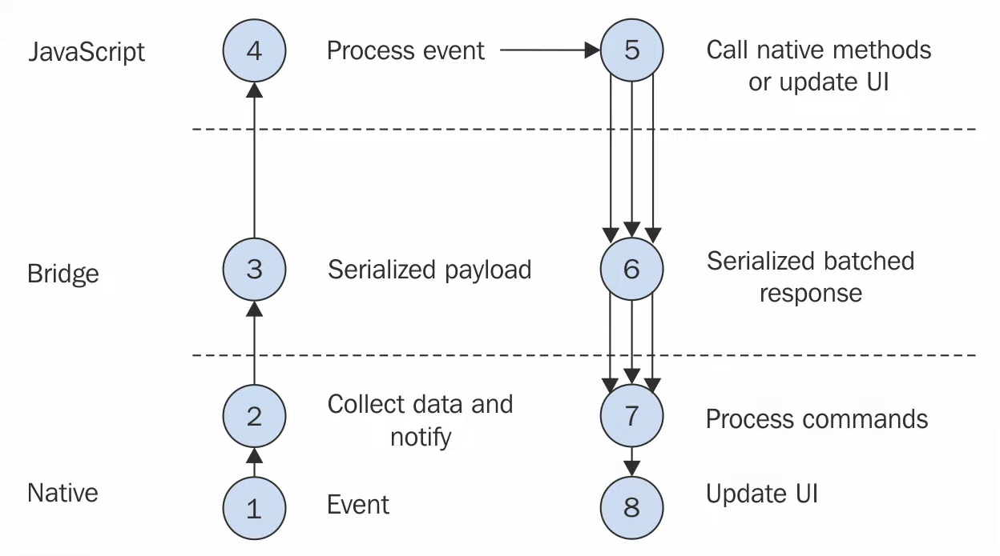
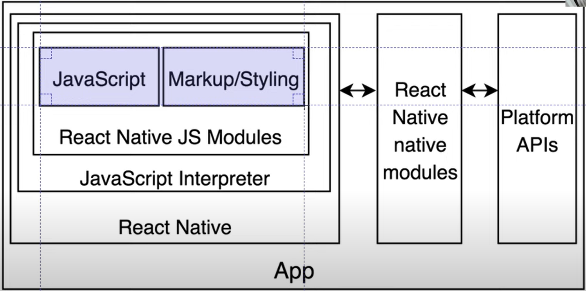

# 리액트 네이티브 동작원리

1) (터치 등) 이벤트가 발생한다.
2) 발생한 이벤트를 Native(안드로이드/iOS)에서 감지한다.
3) 브릿지를 통해 JavaScript로 전송한다.
4) JavaScript에서 이벤트를 처리한다.
5) JavaScript에서 native method를 호출하거나 UI 업데이트 요청을 보낸다.
6) 브릿지를 통해 Native로 전송한다.
7) Native(안드로이드/iOS)에서 요청을 수행한다.
8) Native가 UI를 업데이트하여 그린다.

- App은 위 구조 전체를 포함한다. react native로 작성한 코드는 iOS 코드와 안드로이드 코드로 변환되어 그려진다.

- react native는 브라우저를 이용하지 않는다. 대신 bridge를 통해 native(안드로이드, ios)에 요청을 보낸다.

- 앱을 만들기 위해서는 JavaScript, Markup/Styling 뿐만 아니라 위 그림에 나온 모든 인프라를 설치해야 하지만, 테스터용으로 이 모든 것을 대신해주는 ``Expo``를 설치하면 react native에서 작성한 코드를 안드로이드/iOS에서 바로 실행해볼 수 있다. ``Expo``는 위 그림에서 파란색 영역(JavaScript, Markup/Styling)만 비워 놓은 App과 같아서, 우리가 JavaScript와 Markup/Styling 코드만 작성해 넣으면 앱을 실행할 수 있다. 다만 실제 앱을 만들어 배포하려면 Java, Xcode 등 필요한 인프라를 설치해야 한다.